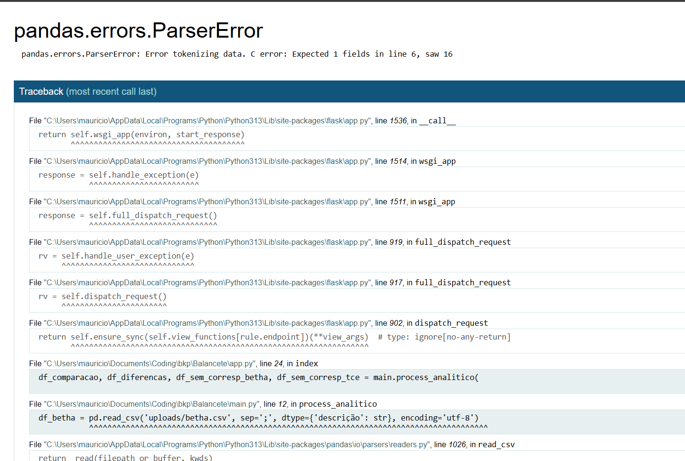

Reconstruir a UI para que fique mais moderna e intuitiva para o usuário.
Quando usuario coloca uma arquivo que não esta no padrão, esta dando

Queria que fosse tratado e aparecesse como uma mensagem de alerta para usuario. Para verificar se os arquivos estão corretos. Caso acredite que esteja correto entrar em contato com administrador.

Pretendo comercializar isso, então pensei em cada cliente ter uma licença. O usuario vai acessar atraves da web então ele colocaria a licença e teria acesso ao sistema. 

Ele vai ser comercializado para prefeituras e cada prefeitura tem seus arquivos. Não queria que uma prefeitura conseguisse comparar o balancete de outra. 
então pensei em cada licença verificar se a licença tem permissão para aquela entidade. A informação da entidade fica na terceira coluna do arquivo do TCE. 
Por exemplo:
Ente: GOVERNADOR CELSO RAMOS

Governador teria licença KYP12 e a empresa teria acesso para comparar o balancete do governador.

Licença pode estar em algum campo  a ser preenchido  na propria pagina. 